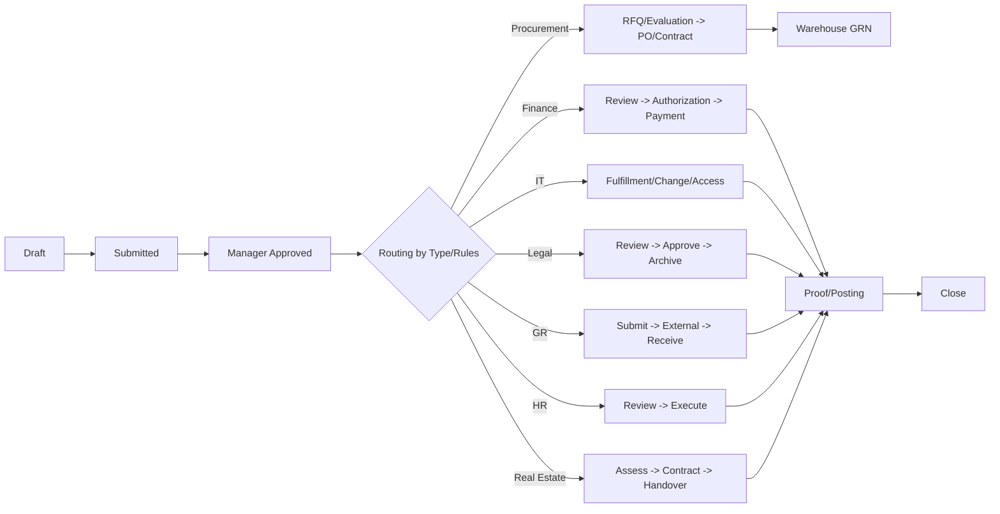

# الدليل التنفيذي لسياسات وإجراءات سير العمل متعدد الإدارات (Blueprint)

> هذا الملف يترجم وثيقة السياسات والإجراءات إلى **مواصفات قابلة للتطبيق داخل النظام** (قواعد بيانات + إعدادات + مسارات عمل + SLA + إشعارات + ضوابط).  
> يمكن توسيعه لاحقًا ليطابق النسخة الكاملة من الدليل حرفيًا.

---

## 1) مبادئ حوكمة عامة

1) **قياسية الحالات** عبر جميع الطلبات.
2) **فصل المهام (SoD)**: من يعتمد ≠ من يدفع/ينفّذ في العمليات الحساسة.
3) **قابلية التكوين** حسب نوع الطلب، المبلغ، الفئة، المخاطر.
4) **قابلية التدقيق**: سجل كامل (من فعل ماذا ومتى) + مرفقات.
5) **الخصوصية والأمن**: أقل صلاحيات + حجب الحقول الحساسة.
6) **التوازي الذكي**: دعم تنفيذ متوازي مع شرط إغلاق ALL‑OF.
7) **الإغلاق الموثق**: لا إغلاق بدون أدلة (GRN، إثبات دفع، ...).

---

## 2) تصنيف الحالات القياسي (Standard Status Taxonomy)

### حالات الطلب (Request)
- Draft
- Submitted
- Manager Approved
- In Review
- In Progress
- On Hold
- Info Required
- Completed
- Closed
- Rejected

### حالات الخطوة (Step)
- queued
- in_progress
- done_pending_approval
- approved
- returned
- rejected
- canceled
- on_hold
- info_required
- in_review

---

## 3) SLA والتنبيهات

- تعيين مهَل لكل خطوة حسب (نوع الطلب + الإدارة المستلمة).
- تنبيهات قبل الاستحقاق، وتصعيد بعد تجاوز SLA.

---

## 4) Routing + Approval Matrix

- Routing حسب قواعد: (المبلغ/الفئة/المخاطر/التوفر ...).
- موافقات حسب حدود التفويض.

---

## 5) Mermaid (مرجع توثيقي)



---

## 6) أمثلة إعدادات JSON

### 6.1 مثال JSON – تكوين طلب لابتوب

```json
{
  "request_type": "IT_Hardware_Laptop",
  "id_key": "national_or_residency_id",
  "statuses": [
    "Draft","Submitted","Manager Approved","IT Policy Check",
    "In Stock | Procurement","Finance Authorization","Warehouse GRN",
    "IT Imaging/Encryption","Handover","Closed","Rejected","Info Required"
  ],
  "roles": {
    "requester": "Employee",
    "approver": "Line Manager",
    "it_reviewer": "IT Service Desk",
    "procurement": "Buyer",
    "finance": ["Finance Reviewer","Financial Approver","Payment Officer"],
    "warehouse": "Storekeeper"
  },
  "routing_rules": [
    {"when": "model_standard AND stock_available", "next": "Warehouse GRN"},
    {"when": "model_standard AND NOT stock_available", "next": "Procurement"},
    {"when": "model_non_standard", "next": "InfoSecApproval THEN Procurement"}
  ],
  "closure_criteria": [
    "AssetTag assigned","Encryption/EDR enabled","Handover form attached"
  ],
  "sla": {
    "manager_approval_days": 1,
    "it_review_days": 1,
    "procurement_days": "5-10",
    "imaging_days": 2
  },
  "attachments_required": ["Justification","Model Spec","Handover Form"]
}
```

### 6.2 مثال JSON – تجديد إقامة

```json
{
  "request_type": "GR_Iqama_Renewal",
  "auto_trigger_days_before_expiry": 60,
  "statuses": [
    "Auto-Created","GR Processing","Finance Fees","Waiting External",
    "Renewed","HRIS Update","Closed","Info Required","On Hold"
  ],
  "roles": {
    "owner": "GR Officer",
    "finance": ["Finance Reviewer","Payment Officer"],
    "hr": "HR Coordinator"
  },
  "closure_criteria": [
    "Renewed document attached",
    "HRIS expiry date updated",
    "Payment proof attached"
  ],
  "notifications": [
    "T-60 reminder","T-30 reminder","T-7 urgent","Renewal completed"
  ]
}
```

---

## 7) ماذا تم تنفيذه في هذه النسخة داخل النظام؟

- دعم حالات إضافية للخطوات (On Hold / Info Required / In Review).
- حقول موسعة على الطلب (المبلغ/العملة/مركز التكلفة/مرجع خارجي/تصنيف/مخاطر).
- SLA بسيط لكل (نوع طلب × إدارة) مع احتساب due_at تلقائيًا.
- عرض SLA (وقت متبقي/تجاوز) في الواجهة.

