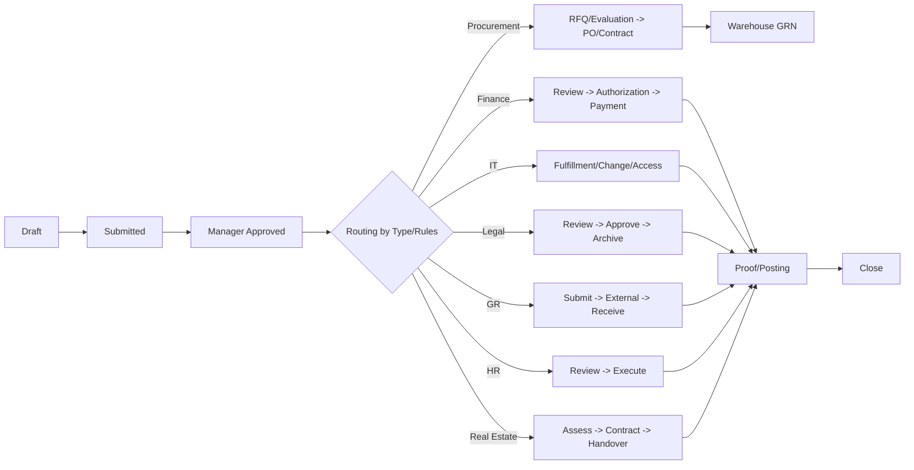

# الدليل التنفيذي لسياسات وإجراءات سير العمل متعدد الإدارات

**Policies & Procedures Manual for Multi‑Department Workflows**

- **التاريخ:** 2026-01-31
- **النسخة:** 1.0
- **إعداد:** Mansour Ghamiah

---

## جدول المحتويات / Table of Contents

(الفهرس التفصيلي يُستكمل لاحقًا عند اعتماد النسخة النهائية.)

---

## 0) الغرض والنتيجة المتوقعة

**الغرض:** توحيد سياسات وإجراءات الطلبات بين الإدارات (المشتريات، المبيعات، المكتب التنفيذي، المالية، الموارد البشرية، تقنية المعلومات، العقارات، العلاقات الحكومية، القانونية، المراجعة الداخلية، المستودعات) مع ضمان الامتثال وفصل المهام وقابلية القياس.

**النتيجة:** كتالوج طلبات جاهز، حالات (Statuses) موحّدة، مصفوفات موافقات وتوجيه (Routing)، SLA وتنبيهات، وضوابط أمنية وتدقيقية—ليُستخدم كـ Blueprint لبناء النظام.

## 1) النطاق والتعريفات

- **الطلب (Request):** كيان عمل يُنشأ لتنفيذ خدمة/إجراء عبر مسارٍ واحد أو متعدّد الإدارات.
- **المسار (Workflow):** سلسلة حالات وانتقالات منظّمة (موافقات/تنفيذ/تحقق/إغلاق).
- **SLA:** مهَل زمنية ملزِمة لكل خطوة مع تصعيد آلي.
- **SoD (فصل المهام):** من يعتمد ≠ من يدفع/ينفّذ (خاصة في المالية).
- **المعرّف الرئيسي للأفراد:** الهوية/الإقامة.

## 2) مبادئ الحوكمة العامة

1. قياسية الحالات عبر جميع الطلبات: Draft, Submitted, Manager Approved, In Review, In Progress, On Hold, Info Required, Completed, Closed, Rejected.
2. فصل المهام في كل ما يتعلق بالصرف/الدفع/التنفيذ الحساس.
3. قابلية التكوين: المسارات تُحدَّد حسب نوع الطلب، المبلغ، الفئة، الجهة، المخاطر.
4. قابلية التدقيق: سجل كامل (من فعل ماذا ومتى) + مرفقات إلزامية.
5. الخصوصية والأمن: Least Privilege، مراجعات وصول دورية، تشفير الأصول التقنية.
6. التوازي الذكي: دعم التنفيذ المتوازي بين الإدارات مع شرط إغلاق ALL‑OF.
7. الإغلاق الموثَّق: لا يُغلق الطلب إلا بإنجازات/إثباتات محدّدة (مثلاً: GRN، Proof of Payment).

## 3) دورة حياة الطلب القياسية (Lifecycle)

### 3.1 الحالات والانتقالات (Standard Status Taxonomy)

مسودة (Draft) → مُرسل (Submitted) → موافقة مدير (Manager Approved) → مراجعة متخصّصة (In Review) → قيد التنفيذ (In Progress) → مطلوب معلومات (Info Required) ↔ (رجوع للتعديل) → مكتمل (Completed) → مغلق (Closed).

مسارات فرعية: معلّق (On Hold)، مرفوض (Rejected)، بانتظار جهة خارجية.

### 3.2 SLA والتنبيهات

تعيين مهَل لكل خطوة (مثلاً: موافقة مدير 2 يوم عمل؛ مراجعة مالية 3 أيام). يشمل ذلك تصعيدًا آليًا وتنبيهات عند التأخر وتذكيرات قبل مواعيد الانتهاء (مثل الإقامات والسجلات).

### 3.3 التدقيق والامتثال

سجل زمني للإجراءات، تعقب تغييرات الحقول الحساسة، هوية المنفذ، وتوثيق المرفقات والتوقيعات الإلكترونية.

### 3.4 الإشعارات

إشعارات عند الإنشاء، الإسناد، طلب معلومات، تجاوز SLA، الموافقات، والإغلاق.

## 4) نموذج البيانات الأساسي (Core Data Model)

### 4.1 الحقول المشتركة

- RequestID، RequestType، Department، Priority، DueDate
- Requester: الاسم، الهوية/الإقامة، القسم، الوظيفة
- Description/Justification، Attachments، CostCenter/Project (إن وجد)
- Amount/Currency (للطلبات المالية)
- ExternalRef (أرقام حكومية/مزود)

### 4.2 المرفقات حسب النوع (أمثلة)

- مشتريات: عروض/مقارنات، PO/عقد
- مالية: فاتورة، إثبات دفع، GRN
- IT: نموذج وصول، موافقة أمن معلومات، Asset Tag
- GR: جواز، إقامة، رسوم
- قانونية: مسودة عقد، تعليقات، نسخة موقعة

## 5) الأدوار والصلاحيات (RBAC) + فصل المهام

- طالب الخدمة / الموظف
- المدير المباشر
- مراجع متخصص (مالية/قانونية/GR/IT/…)
- معتمد مالي وفق الحدود
- منفذ الدفع/العملية (≠ المعتمد)
- مالك العملية / المنسّق
- التدقيق/الامتثال (قراءة + تعليق)

سياسة SoD: في المدفوعات، Financial Approver ≠ Payment Officer. في IT، من يوافق وصولًا إداريًا ≠ من يمنح الصلاحية تقنيًا.

## 6) مصفوفة التوجيه (Routing Matrix) – ملخص

- مشتريات ⇄ مالية ⇄ مستودعات
- مبيعات ⇄ مالية ⇄ قانونية ⇄ تنفيذي
- HR ⇄ IT ⇄ GR ⇄ مالية
- عقارات ⇄ قانونية ⇄ مالية ⇄ مشتريات
- IT ⇄ أمن معلومات ⇄ مالكي الأنظمة

## 7) مصفوفة الموافقات (Approval Matrix) – قالب

قم بتعديل الحدود بما يتوافق مع سياسة التفويض لديكم:

- مشتريات: مدير القسم → مشتريات (≤ 20,000)، مالية (20,001–100,000)، تنفيذي (> 100,000)
- خصومات مبيعات: مدير مبيعات → مالية (≤ 10%)، تنفيذي (> 10%)
- IT غير قياسي: مدير → InfoSec + تنفيذي (وصول حساس)

## 8) التكاملات (Integrations)

- ERP/Finance: أوامر شراء، فواتير، قيود، دفع، أصول ثابتة
- HRIS: بيانات الموظف، الإقامات، الانضمام/الخروج
- ITSM: Incidents/Requests/Changes/Assets
- Government Portals: الإقامات، السجلات، التأشيرات (عبر GR)
- DMS/Archive: أرشفة العقود والفواتير والقرارات

## 9) الخصوصية والأمن

- Least Privilege وNeed‑to‑Know ومراجعات وصول دورية
- تشفير الأجهزة + EDR للأصول التقنية
- حجب الحقول الحساسة (PII/IBAN …) حسب الدور

## 10) الاحتفاظ بالسجلات (Retention)

مالية وعقود: 10 سنوات (أو حسب السياسة المحلية). سجلات وصول/أمن: 1–3 سنوات. يمكن تعديلها وفق متطلباتكم القانونية.

## 11) إجراءات تشغيل قياسية (SOPs) حسب الإدارة

### 11.1 المشتريات (Procurement PR/PO)

- الغرض: شراء مواد/خدمات. من يبدأ: موظف/مدير.
- الحالات: Draft → Submitted → Manager Approved → RFQ/Evaluation → Finance Approval (إن لزم) → PO/Contract → Delivery/GRN → Closed.
- القواعد: آلية الطرح حسب المبلغ/الفئة؛ تطابق ثلاثي قبل الإغلاق.
- SLA: مدير 2يوم؛ RFQ 5–10أيام؛ تقييم 3أيام؛ PO 2يوم.

### 11.2 المبيعات (Sales Discount/Contract)

- الغرض: خصومات/عقود. من يبدأ: مندوب.
- الحالات: Draft → Sales Manager → Finance → Legal → (Executive) → Issue → Close.
- القواعد: خصومات أعلى تضيف موافقات تلقائيًا؛ KYC عميل جديد.

### 11.3 المكتب التنفيذي (Executive Exceptions)

- الغرض: استثناءات وقرارات عليا.
- الحالات: Intake → Review → Decision → Assignment → Follow‑up → Close.

### 11.4 المالية (Payments/Expenses/Journal Entries)

- القواعد: SoD، حدود صلاحيات، إثبات دفع.
- الحالات: Draft → Finance Review → Authorization → In Payment → Paid → Closed.

### 11.5 الموارد البشرية (HR)

- الغرض: توظيف/تغييرات/إجازات/مزايا/خروج.
- الحالات: Draft → Manager Approval → HR Review → (Finance/Executive) → Execute → Notify → Close.
- On/Off‑boarding: قوائم تحقق متعددة الإدارات (HR/IT/GR/Finance/Warehouse).

### 11.6 تقنية المعلومات (IT – Service/Incident/Change)

- Service: Draft → (Manager if spend) → IT Fulfillment → QA/Test → Completed → Closed.
- Incident: Logged → Diagnose → In Progress → Resolved → Closed.
- Change (CAB): Change Req → Risk Assessment → CAB → Implement → Verify/Rollback → Close.

قواعد: وصول حساس عبر InfoSec؛ تغييرات الإنتاج عبر CAB.

### 11.7 العقارات/المرافق (Real Estate/Facilities)

- الحالات: Assessment → Legal/Finance → Contract/Works → Handover → Close.

### 11.8 العلاقات الحكومية (GR)

- الغرض: إقامات، تأشيرات، رخص/CR، خطابات.
- الحالات: Draft/Auto → GR Processing → Finance Fees → External Authority → Received → Update Systems → Close.
- محرّكات زمنية: قبل انتهاء الوثائق (T‑60/T‑30/T‑7).

### 11.9 القانونية (Legal)

- الحالات: Legal Intake → Review/Comments → Negotiation → Final Approval → Archive → Close.

### 11.10 المراجعة الداخلية (Internal Audit)

- الحالات: Planning → Fieldwork → Draft Report → Management Responses → Final Report → Action Plans → Follow‑up → Close.

### 11.11 المستودعات (Warehouses)

- الاستلام: مورد → مستودع (فحص/إضافة) → إشعار مالية/مشتريات.
- الصرف: طلب → موافقة → تجهيز → تسليم → تسجيل → إغلاق.

قواعد: لا إقفال PO دون GRN؛ صلاحيات صرف وكميات.

## 12) الطلبات الخاصة

### 12.1 تجديد الإقامة (Iqama Renewal)

- من يبدأ: HR/جدولة تلقائية.
- الحالات: Auto‑Create → GR → Finance Fees → External → Renewed → HRIS Update → Close.
- الإغلاق: وثيقة مُجدّدة + تحديث السجلات.

### 12.2 إصدار/تجديد سجل تجاري (CR)

- من يبدأ: قانونية/تنفيذي.
- الحالات: Legal Review → Internal Approvals → GR Submission → Finance Fees → External → Issued/Renewed → Archive → Close.

### 12.3 خروج وعودة (Exit & Re‑Entry)

- من يبدأ: موظف/مدير/HR.
- الحالات: Manager Approval → HR Check → GR Issuance → Finance Fees → Visa Issued → Notify → Close.

### 12.4 حجز طيران وفنادق (Travel Booking)

- من يبدأ: موظف/مدير مشروع.
- الحالات: Travel Request → Approvals → Booking (Proc/Agency) → (Advance) → Tickets/Vouchers → Trip → Expense Settlement → Reimbursement → Close.

## 13) سيناريوهات متعددة الإدارات

- **شراء جهاز لابتوب:** موظف → مدير → IT تحقق سياسة → (متوفر) مستودعات → IT تهيئة → تسليم → إغلاق؛ أو (غير متوفر) مشتريات → مالية → مستودعات → IT → تسليم → إغلاق؛ أو (غير قياسي) InfoSec/تنفيذي → مشتريات/مالية → ...
- **شراء مواد مع دفع واستلام:** موظف → مدير → مشتريات (RFQ/PO) → مالية (تفويض/دفع) → مستودعات (GRN) → إغلاق.
- **عقد مبيعات بخصم استثنائي:** مندوب → مدير مبيعات → مالية → قانونية → (تنفيذي) → إصدار → تسليم/فاتورة → إغلاق.
- **استئجار موقع جديد:** عقارات تقييم → قانونية (عقد) → مالية (ميزانية/تفويض) → مشتريات (تهيئة) → استلام → إغلاق.

## 14) مؤشرات الأداء والتقارير (KPIs & Reports)

- الالتزام بالـSLA (% الطلبات ضمن المهَل)
- زمن الدورة (Cycle Time) لكل نوع طلب
- معدّل الإرجاع للتعديل (Rework Rate)
- معدّل العوائق الخارجية (External wait)
- امتثال SoD في المالية وIT
- حجم الطلبات حسب القسم/الحالة/الأولوية

## 15) إدارة التغيير والتحسين المستمر

تعتمد تغييرات المسارات عبر لجنة حوكمة (مالك العملية + IT + Finance/Legal عند الحاجة). مراجعة ربع سنوية لـ SLA والموافقات والضوابط. تفعيل تجارب لتحسين الأداء وتبسيط الخطوات المتكررة.

## 16) قوالب تكوين (Config) جاهزة

### 16.1 مخطط Mermaid عام (للأرشفة/التوثيق)



### 16.2 مثال JSON – تكوين طلب لابتوب

```json
{
  "request_type": "IT_Hardware_Laptop",
  "id_key": "national_or_residency_id",
  "statuses": [
    "Draft","Submitted","Manager Approved","IT Policy Check",
    "In Stock | Procurement","Finance Authorization","Warehouse GRN",
    "IT Imaging/Encryption","Handover","Closed","Rejected","Info Required"
  ],
  "roles": {
    "requester": "Employee",
    "approver": "Line Manager",
    "it_reviewer": "IT Service Desk",
    "procurement": "Buyer",
    "finance": ["Finance Reviewer","Financial Approver","Payment Officer"],
    "warehouse": "Storekeeper"
  },
  "routing_rules": [
    {"when": "model_standard AND stock_available", "next": "Warehouse GRN"},
    {"when": "model_standard AND NOT stock_available", "next": "Procurement"},
    {"when": "model_non_standard", "next": "InfoSecApproval THEN Procurement"}
  ],
  "closure_criteria": [
    "AssetTag assigned","Encryption/EDR enabled","Handover form attached"
  ],
  "sla": {
    "manager_approval_days": 1,
    "it_review_days": 1,
    "procurement_days": "5-10",
    "imaging_days": 2
  },
  "attachments_required": ["Justification","Model Spec","Handover Form"]
}
```

### 16.3 مثال JSON – تجديد إقامة

```json
{
  "request_type": "GR_Iqama_Renewal",
  "auto_trigger_days_before_expiry": 60,
  "statuses": [
    "Auto-Created","GR Processing","Finance Fees","Waiting External",
    "Renewed","HRIS Update","Closed","Info Required","On Hold"
  ],
  "roles": {
    "owner": "GR Officer",
    "finance": ["Finance Reviewer","Payment Officer"],
    "hr": "HR Coordinator"
  },
  "closure_criteria": [
    "Renewed document attached",
    "HRIS expiry date updated",
    "Payment proof attached"
  ],
  "notifications": [
    "T-60 reminder","T-30 reminder","T-7 urgent","Renewal completed"
  ]
}
```

## 17) مصفوفة RACI (مختصرة)

- PR/PO مشتريات: R=مشتريات, A=مدير المشتريات, C=مالية/مستودعات, I=طالب/مدير
- دفع فاتورة: R=مالية (مدقق/دافع), A=مدير مالي, C=مشتريات, I=طالب
- عقد مبيعات: R=مبيعات, A=مدير المبيعات, C=مالية/قانونية, I=تنفيذي
- لابتوب: R=IT, A=مدير IT, C=مشتريات/مستودعات, I=مالية
- تجديد إقامة: R=GR, A=مدير GR, C=HR/مالية, I=الموظف/المدير

